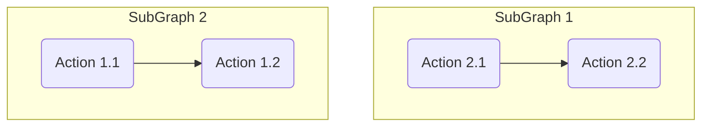

This is just a nice place I am going to write notes documenting the process of playing around with this. All of these are a work in progress and the order of things is very sporatic.

This will be a mish mash of [Hugo's Documentation](https://gohugo.io/documentation/) and [Shadocs Documentation (this theme)](https://shadocs.netlify.app/theme/introduction/)

# Example Front Matter

```
---
title: 'Markdown Test'
description: 'Markdown Testing File'
date: {{ .Date }}
draft: false
categories: ['Research']
tags: ['Test', 'Home']
authors: ["David"]
titleIcon: "fa-sharp fa-solid fa-flask"
---
```

What is what

| Element | Type | Usage |
|:---|:---:|:---|
| **Title** | String |  The name of the article, this name is shown on the top and sidebar |
| **Description** | String | Short summary of the article when using Search or the Taxonomy Lookup
| **Date** | Date Object | Date it was created (or custom date)
| **Draft** | Boolean | If article is draft, it does not show up in the sidebar |
| **Catergories** | Array | Built-in Catergory Taxonomy |
| **Tags** | Array | Built-in Tags Taxonomy |
| **Authors** | Array | Custom Made Authors Taxonomy |
| **Title Icon** | String | Uses fontawesome to make the icons on the sidebar |


# Theme Customization

There is a file inside of `themes/shadocs/assets/sass/custom/`

There are custom SASS variables for changing various things about the theme.

Some of them include 
 - Header Font Size
 - Theme Colors*
 - Gap Width
 - Font Size

While these files are nice, they do **not** have everything.

If you're looking to edit something thats not in those files, you're going to have to:

 - *Inspect Element* 
 - Look for an ID or class of the element
 - Use something like VSCodes search for that element in the SASS files.

There is no need to rebuild SASS as Hugo handles all of that.

Images, Fonts, and Extra CSS go inside of `static`, most examples I see, split them into their own folders. This also means the static portion is not included in file location.

So for the Huskie logo up in the top corner, the config.toml contains 

```toml
  logo = "images/Huskie.png"
  logoTouch = "images/Huskie.png"
  favicon = "images/Huskie.png"
```

# Posts / Articles / Knowledge Base

Most of what we are putting on this website will be placed inside of `content` folder.

Not only can you use front matter to categorize stuff, this theme also lets you use the folder directories themselves. If you look at the sidebar to the left, there is a dropdown called `Posts` this is an actual folder named Posts and I have a test markdown file placed inside of there.

For each folder you can specify an `_index.md`, think of this like the "Landing Page" for that specific section.

This can have similar front matter to any page, but what is nice about that is you can leave it blank and it won't be a landing page, only a "Folder" like organization

Author Taxonomy did not exist inside of this theme. So I added it. Still a little sloppy, but this page has some authors, but if you go to the WiFi page, it is gone, because there is no authors in the front matter.

Images can be added like so:

```

```

# Auto Generated Table of Contents

Enabled by default, but if a page is super short, you can add `toc: false` on a per page basis to disable it.

For some reason, the `_index.md` pages, they are always off

An example of ToC would be [Cable TV Support](/tv/restech-helpdesk-cable-tv-support.html/) and an example without would be [Programming Logitech Remote](/tv/restech-helpdesk-programming-logitech-smart-tv-remote.html/) (or this page)

# Mermaid Graphs


# Shortcodes

These are custom made helped functions for resuable code chunks. They are all usable inside of markdown.

A good example is the [banner demo page](/test/banner/) 

Some more useful ones are:

## Plaintext

For escape long segments of html and markdown


<p> Hello There! </p>

**mardown** format does ~~not work~~ here


## TreeView

This tree view updates automatically via the given path.



## Collapsible Sections


I am hidden


## Async API

I do not have a good example, [so here is the docs on it](https://shadocs.netlify.app/shortcodes/asyncapi/)

## Snippets

Snippets are chunks of reusable markdown. There are stored within the templates folder and inserted like so:



This function is not hardcoded into the webpage. It is all inside of the file `templates/snippet.go`

This might be more versatile over the GitLab snippets as when you update the snippet, it updates every page it is on.